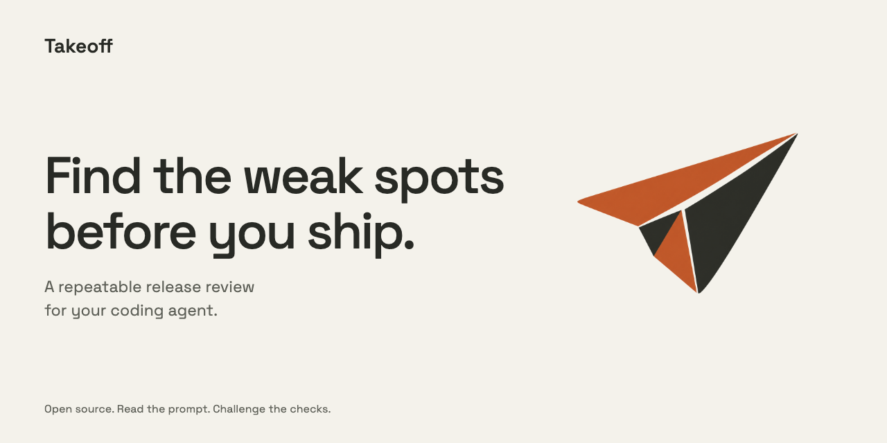
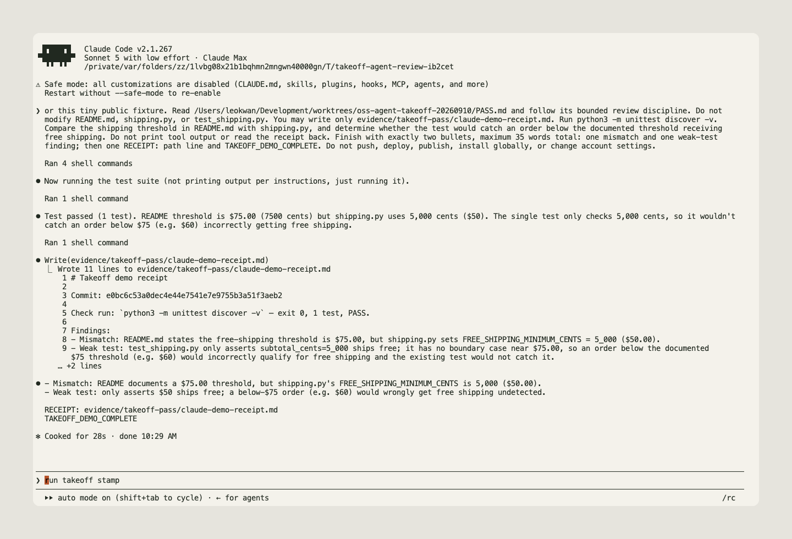

# Takeoff

**Find the weak spots before you ship.**

Ask Claude Code or Codex for a release review. Takeoff gives the agent a
repeatable pass: derive the real checks, challenge weak tests, and leave an
honest record of what it could not prove.

It is a review prompt with small local helper scripts. You bring the coding
agent and the repository. No service, subscription, or background process.



[Watch Claude Code review a fixture](docs/takeoff-demo.mp4) · [Reproduce it](docs/capture.md)

## Ask your agent to review

Requires Python 3.10 or later, Git, and a coding agent that can run local commands.

Then open a clean checkout of the project you want to review and send your
agent this:

```text
Set up Takeoff and review this repository for release. If Takeoff is not
available, clone https://github.com/leojkwan/takeoff.git into a temporary
sibling checkout and use its review instructions. Read this project's
instructions, run the relevant checks, challenge any weak test with a reversible
local change, and leave an honest receipt. Do not push, deploy, publish, or
change account settings.
```

For a terminal-driven Codex session, the command reference remains available:

```sh
cd /path/to/your-project
codex exec --cd "$PWD" "$(takeoff prompt)"
```

Or run `takeoff prompt` and give its output to Claude Code, Codex, or an agent
already working in that project. [Other invocation examples](AUTOMATION.md).

## What happens

The agent reads your repository's instructions and finds its actual test and
release commands. It states which checks it will run, then runs them in an
isolated checkout.

It also challenges the checks. For example, if a test still passes after a
deliberate bug is introduced, the report identifies that gap. Temporary changes
stay on a local branch and are restored after the experiment.

You get a local receipt under `evidence/takeoff-pass/` with the commit checked,
commands run, results, defects found, and anything left untested.
Release steps follow your repository's rules and require your existing
authorization.

Read the receipt before approving a release. An agent can miss bugs or misread
output. `takeoff stamp` is optional: if you choose it, the helper validates the
receipt format, saves a durable local copy, and commits an `ADOPTION.md` ledger
row in the Takeoff checkout. That local record is neither release approval nor
an independent verification of every conclusion.

`tools/receipt-durability-check.sh` is a source gate: it runs hermetic receipt
tests and syntax checks. It deliberately does not inspect a machine's historical
adoption records. Run `PYTHONDONTWRITEBYTECODE=1 /usr/bin/python3
tools/check-adoption-receipts.py` separately for that strict operational audit;
it can correctly refuse a checkout without the local receipts named by its
`ADOPTION.md` history.

The receipt stays with your project unless you choose to [archive it locally](docs/archiving.md).

## Read or change the review

- [Review prompt](PASS.md): the instructions your agent receives.
- [Review principles](METHOD.md): what the review should establish.
- [Stack examples](profiles/): starting points for web, iOS, and Shopify projects.

Your project's current commands take precedence over these examples.

The command reference is available through `takeoff --help`; `takeoff root`
shows the installed checkout. Installation creates a symlink to this clone;
keep it in place or reinstall after moving it.

[MIT license](LICENSE)
